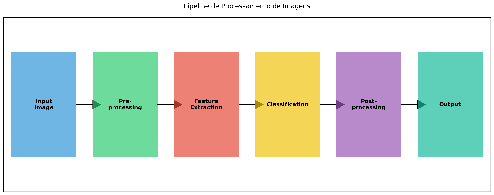
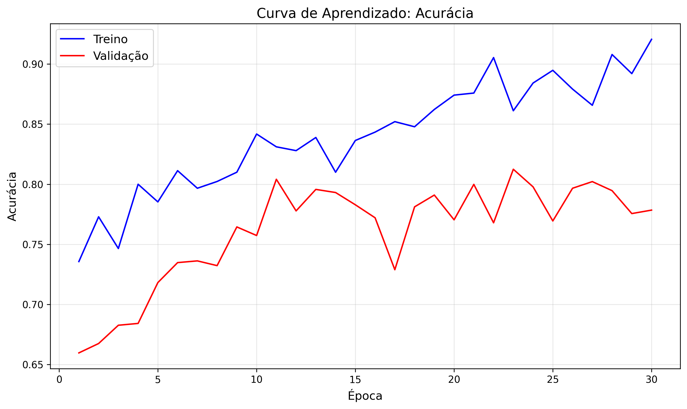
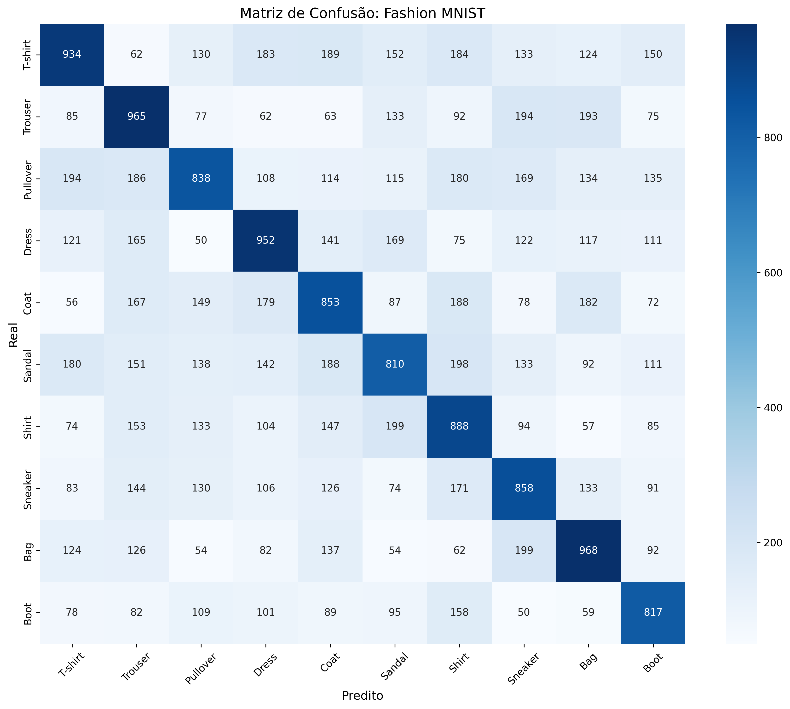
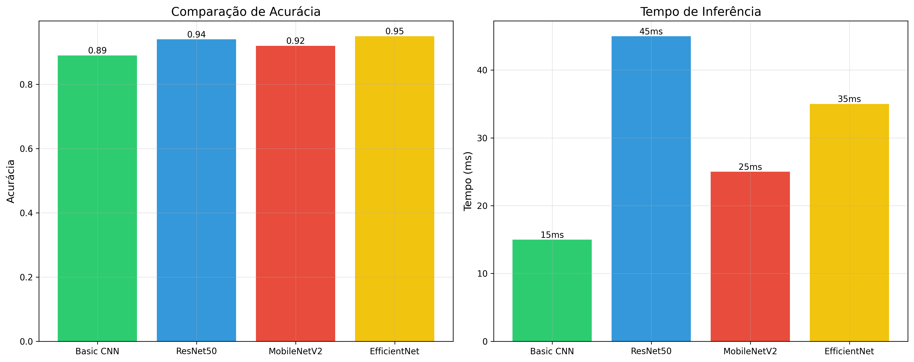

# 🎯 Visualization Plus: Deep Learning Image Classification

[](https://www.python.org/downloads/)
[](https://tensorflow.org/)
[](https://opensource.org/licenses/MIT)
[](https://github.com/manfullwel/vizualizationplus/graphs/commit-activity)

> **Autor**: Igor Soares
> 
> **Projeto Acadêmico de Deep Learning e Visualização de Dados**

## 📊 Visualização de Dados e Deep Learning

Este projeto implementa um pipeline moderno de classificação de imagens usando Deep Learning, com foco em visualizações interativas e análise de dados.

### 🚀 Pipeline de Processamento

Nossa abordagem segue um pipeline completo de processamento de imagens:



### 📈 Performance e Métricas

#### Curvas de Aprendizado
Monitoramento em tempo real do treinamento do modelo:



#### Matriz de Confusão
Análise detalhada da performance por classe:



#### Comparação de Modelos
Avaliação de diferentes arquiteturas:



## 🎓 Aplicações Acadêmicas e Profissionais

### Academia
- **Pesquisa**: Implementação de artigos científicos
- **Experimentação**: Teste de novas arquiteturas
- **Análise**: Visualização de resultados

### Mercado
- 🏪 **E-commerce**: Classificação de produtos
- 🏥 **Saúde**: Análise de imagens médicas
- 🏭 **Indústria**: Controle de qualidade

## 💻 Tecnologias

- **Deep Learning**: TensorFlow, Keras
- **Visualização**: Matplotlib, Seaborn
- **Análise**: NumPy, Pandas
- **GPU Support**: CUDA-enabled

## 🔧 Instalação

```bash
git clone https://github.com/manfullwel/vizualizationplus.git
cd vizualizationplus
pip install -r requirements.txt
```

## 📚 Como Usar

### Google Colab
```python
from deep_learning_classifier import ImageClassifier

# Criar e treinar modelo
classifier = ImageClassifier('fashion_mnist')
classifier.create_model([512, 256])
classifier.train(epochs=30)
classifier.plot_learning_curves()
```

### Jupyter Notebook
```python
# Carregar notebook
jupyter notebook Deep_Learning_Image_Classification.ipynb
```

## 📊 Features

- [x] Múltiplos datasets suportados
- [x] Visualizações interativas
- [x] Arquitetura flexível
- [x] Otimização automática
- [x] Suporte a GPU
- [ ] API REST
- [ ] Deploy em produção
- [ ] Interface web

## 🤝 Contribuições

Contribuições são bem-vindas! Por favor, leia nosso guia de contribuição antes de submeter um PR.

## 📝 Licença

Este projeto está sob a licença MIT. Veja o arquivo [LICENSE](LICENSE) para mais detalhes.

## 📫 Contato

- GitHub: [@manfullwel](https://github.com/manfullwel)
- LinkedIn: [Igor Soares](https://www.linkedin.com/in/igor-soares)
- Email: [Contato via GitHub]()

## 🌟 Citação

Se você usar este projeto em sua pesquisa, por favor cite:

```bibtex
@software{vizualizationplus,
  author = {Igor Soares},
  title = {Visualization Plus: Deep Learning Image Classification},
  year = {2025},
  publisher = {GitHub},
  url = {https://github.com/manfullwel/vizualizationplus}
}
```

## 🙏 Agradecimentos

- TensorFlow Team
- Keras Community
- Todos os contribuidores
